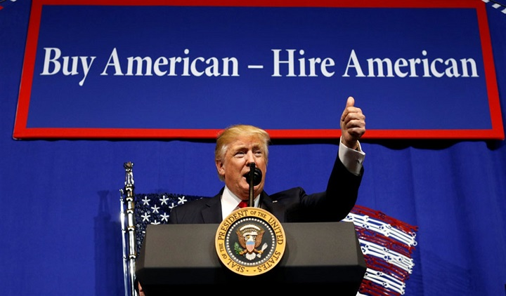

##### _Xingyuan Chen, Xin He, Yunzhi Qian, Stephanie Zhen and Katie Gao_

<center>


</center>


```{r setup, include=FALSE}
knitr::opts_chunk$set(echo = TRUE)
```

<br>

<h2>Background</h2> 

The H-1B is the most common visa U.S. employers use to bring skilled foreign workers to the states. Laws limit the maximum distribution of new H-1B visas each year and the selection process involves random computer generation from an eligible application pool, also known as the “H-1B lottery” by some. The standard duration of stay with H-1B visa is three years, but can be extended up to six years. 

<br>

<center>

```{r echo = FALSE, message = FALSE}
library(tidyverse)
library(viridis)
library(plotly)

options(digits = 2)

h1b_petition = tibble(
  year = c(2012:2018),
  petition_number = c(307713, 299467, 318824, 348669, 398718, 403675, 418799),
  approval_number = c(262569, 286773, 315857, 275317, 345262, 365682, 332358),
  denial_rate = 1 - (approval_number / petition_number),
  denial_rate_percent = denial_rate * 100
)

h1b_petition %>% 
  plot_ly(x = ~year, y = ~petition_number, name = 'Number of H-1B Petitions Filed', type = 'scatter', mode = 'lines+markers') %>% 
  add_trace(y = ~approval_number, name = 'Number of H-1B Petitions Approved', mode = 'lines+markers') %>% 
  layout(
    xaxis = list(title = ' '),
    yaxis = list(
      title = ' ',
      range = c(0,500000)),
    legend = list(x = 0.05, y = 1)
  )
```
_Data Source: USCIS FY 2014 & 2018 Annual Reports for H-1B Petitions_

</center>

<br>

Since 2017, as part of its efforts to “hire American,” the Trump administration has planned to further restrict access to American visas, which has caused U.S. Citizenship and Immigration Services to more strictly regulate and review H-1B applications. This may explain the decreasing number of approved H-1B visa applications in 2018, even as the number of filed H-1B petitions has risen.

Since the number of H1-B petitions filed each year is directly shaped by employer demand for work, which is influenced by the strength of the economy, the increasing number of yearly H-1B visa applicants may indicate that the current political environment has not had a large influence on employer's interests to sponsor alien workers.

<br>



<br>

<h2>Screencast</h2> 

For a brief overview of our website, you can view our screencast [here](https://vimeo.com/377596366). 

<br>

```{r echo=FALSE, message = FALSE, warning=FALSE}
library(vembedr)
embed_url("https://vimeo.com/377596366")
```


<br>

<h2>Additional Links</h2> 

[Everything you need to know](https://www.upcounsel.com/h1b-visa-status) about the H-1B visa: this answers questions related to what it is, how much it costs, who qualifies, as well as pros and cons.

[Key-facts](https://www.pewresearch.org/fact-tank/2017/04/27/key-facts-about-the-u-s-h-1b-visa-program/) of the H-1B visa: more statistics!

[Employer data hub](https://www.uscis.gov/h-1b-data-hub): this includes data from fiscal year 2009 through the third quarter of fiscal year 2019 on employers who have submitted petitions to employ H-1B nonimmigrant workers.

